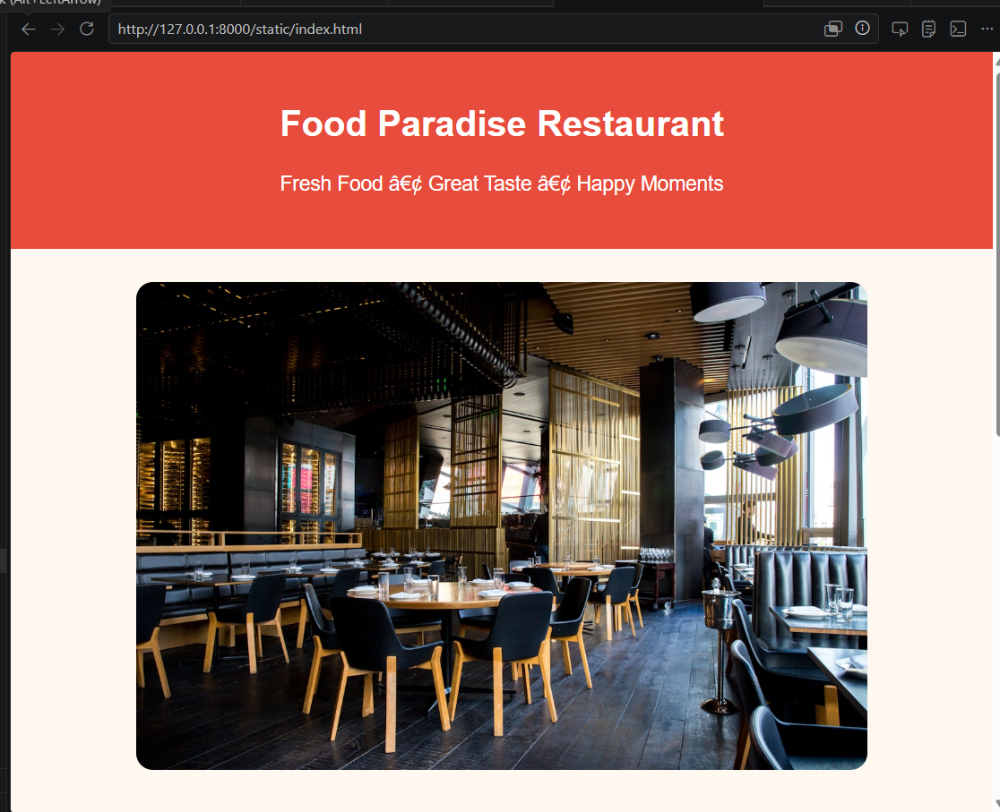
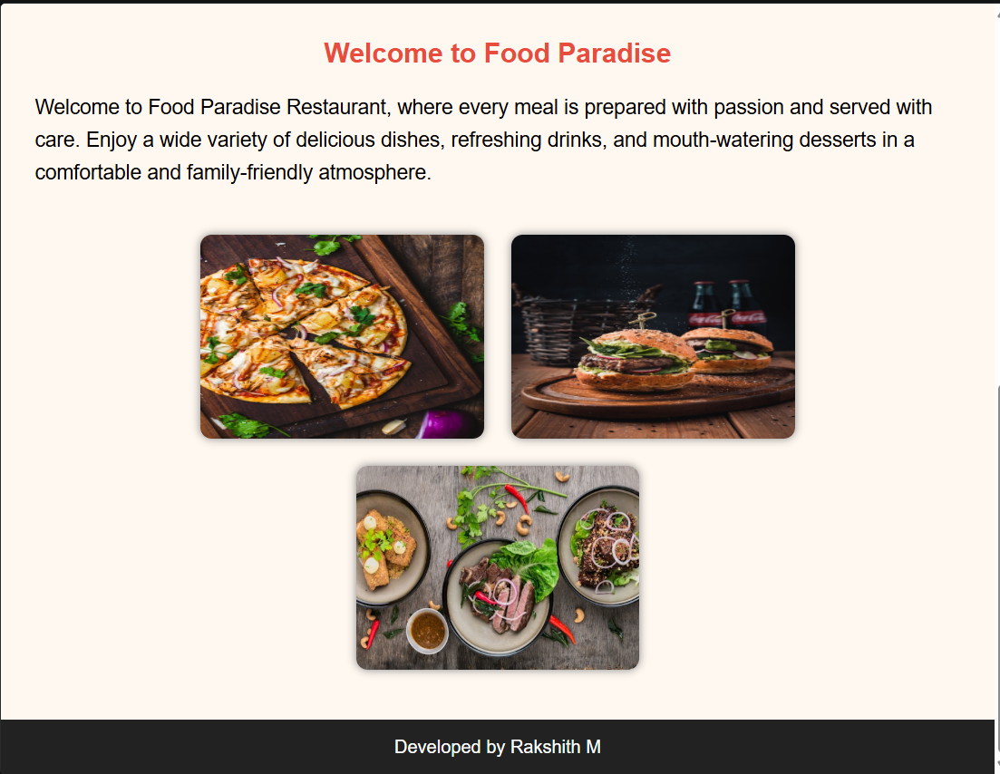
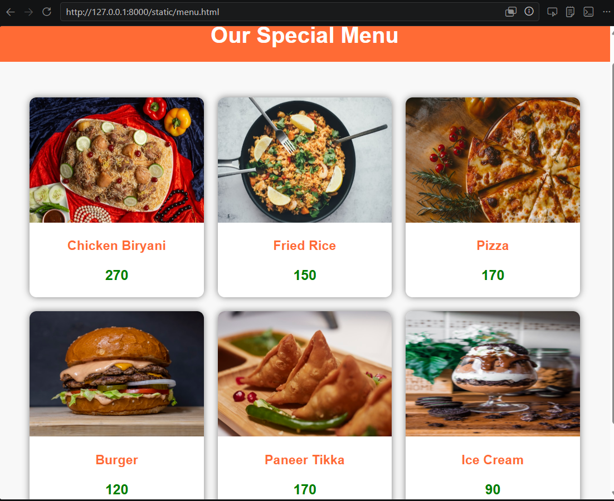
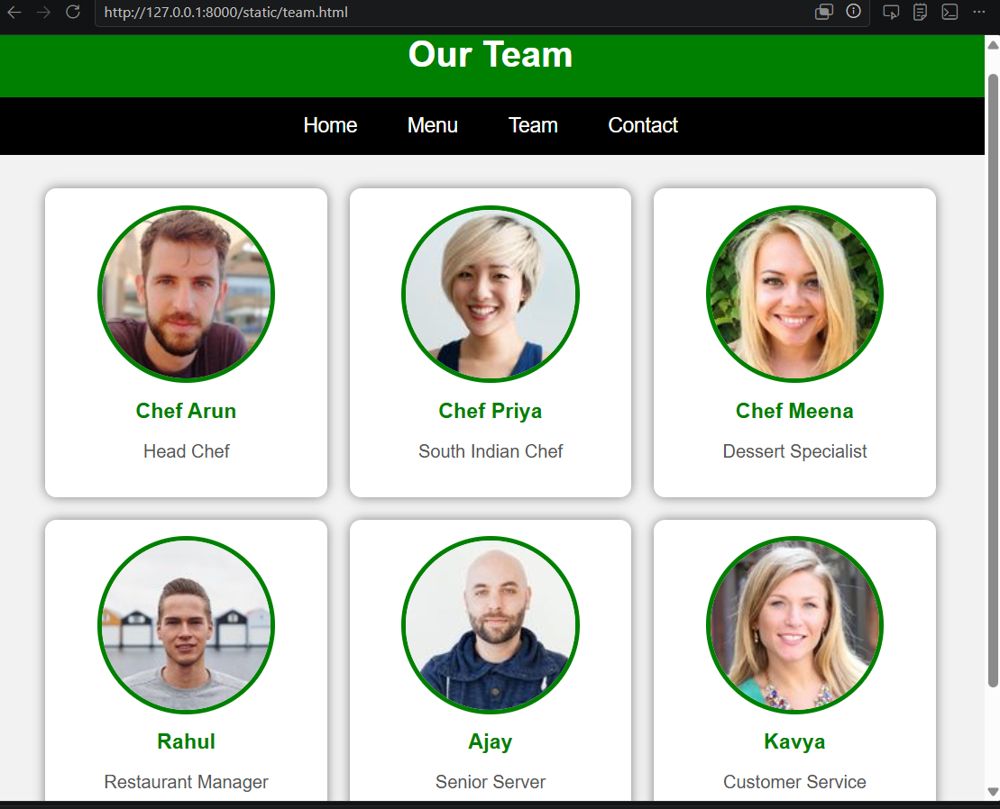
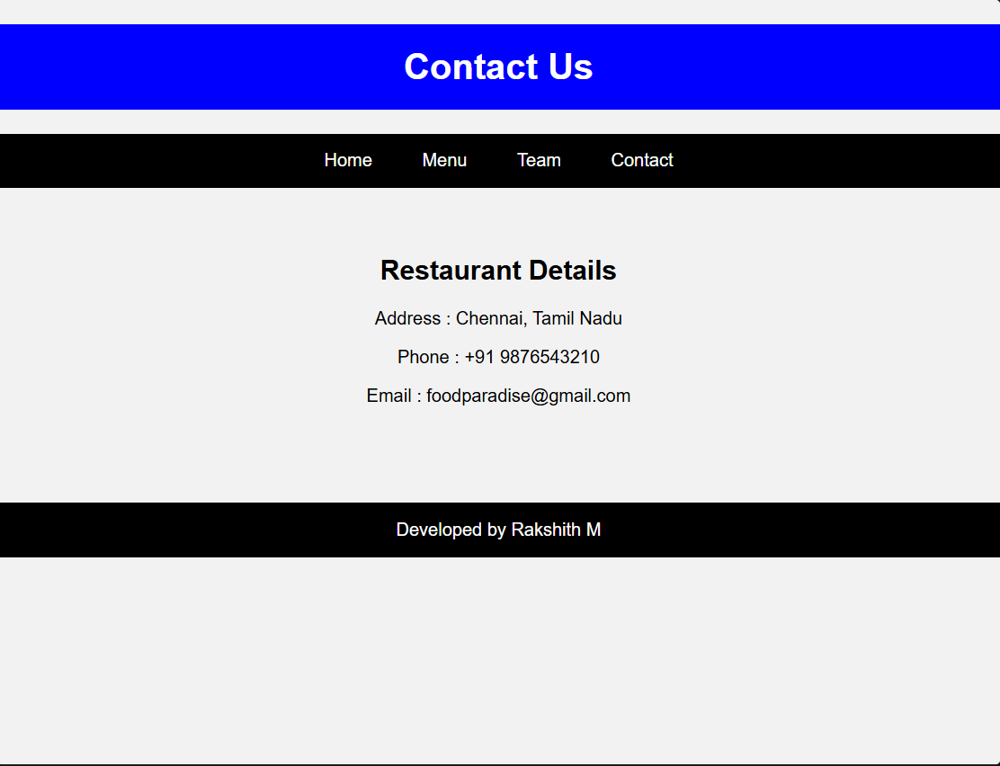

# Ex.06 Restuarant Website
## Date:26-05-2026

## AIM:
To develop a static Resturant website to display the menu and services provided by the resturant.

## DESIGN STEPS:

### Step 1:
Requirement collection.

### Step 2:
Creating the layout using HTML and CSS.

### Step 3:
Updating the sample content.

### Step 4:
Choose the appropriate style and color scheme.

### Step 5:
Validate the layout in various browsers.

### Step 6:
Validate the HTML code.

### Step 7:
Publish the website in the given URL.

## PROGRAM:

## index.html
```
<!DOCTYPE html>
<html>
<head>
    <title>Home - Food Paradise</title>

    <style>

        body{
            margin:0;
            font-family:Arial, sans-serif;
            background:#fff8f0;
        }

        header{
            background:#e74c3c;
            color:white;
            text-align:center;
            padding:25px;
        }

        .hero{
            text-align:center;
            padding:30px;
        }

        .hero img{
            width:80%;
            max-width:900px;
            border-radius:15px;
        }

        h2{
            color:#e74c3c;
        }

        p{
            font-size:18px;
            line-height:1.6;
            padding:0 30px;
        }

        .gallery{
            text-align:center;
            margin:30px;
        }

        .gallery img{
            width:250px;
            height:180px;
            margin:10px;
            border-radius:10px;
            box-shadow:0px 0px 8px gray;
        }

        footer{
            background:#222;
            color:white;
            text-align:center;
            padding:15px;
            margin-top:20px;
        }

    </style>
</head>

<body>

<header>
    <h1>Food Paradise Restaurant</h1>
    <p>Fresh Food • Great Taste • Happy Moments</p>
</header>

<div class="hero">
    
</div>

<center>
    <h2>Welcome to Food Paradise</h2>
</center>

<p>
    Welcome to Food Paradise Restaurant, where every meal is prepared with
    passion and served with care. Enjoy a wide variety of delicious dishes,
    refreshing drinks, and mouth-watering desserts in a comfortable and
    family-friendly atmosphere.
</p>

<div class="gallery">

    

    

    

</div>

<footer>
    Developed by Rakshith M
</footer>

</body>
</html>

```
## menu.html
```
<!DOCTYPE html>
<html>
<head>
<title>Menu</title>

<style>

body{
    margin:0;
    font-family:Arial,sans-serif;
    background:#f8f8f8;
}

h1{
    background:#ff6b35;
    color:white;
    text-align:center;
    padding:20px;
}

.container{
    display:flex;
    flex-wrap:wrap;
    justify-content:center;
    gap:20px;
    padding:30px;
}

.card{
    width:250px;
    background:white;
    border-radius:10px;
    overflow:hidden;
    box-shadow:0 0 10px gray;
    text-align:center;
}

.card img{
    width:100%;
    height:180px;
}

.card h3{
    color:#ff6b35;
}

.price{
    color:green;
    font-size:20px;
    font-weight:bold;
}

footer{
    background:black;
    color:white;
    text-align:center;
    padding:15px;
    margin-top:20px;
}

</style>
</head>

<body>

<h1> Our Special Menu</h1>

<div class="container">

    <div class="card">
        
        <h3>Chicken Biryani</h3>
        <p class="price">270</p>
    </div>

    <div class="card">
        
        <h3>Fried Rice</h3>
        <p class="price">150</p>
    </div>

    <div class="card">
        
        <h3>Pizza</h3>
        <p class="price">170</p>
    </div>

    <div class="card">
        
        <h3>Burger</h3>
        <p class="price">120</p>
    </div>

    <div class="card">
        
        <h3>Paneer Tikka</h3>
        <p class="price">170</p>
    </div>

  

    <div class="card">
        
        <h3>Ice Cream</h3>
        <p class="price">90</p>
    </div>


</div>

<footer>
    Developed by Rakshith M
</footer>

</body>
</html>
```
## team.html
```
<!DOCTYPE html>
<html>
<head>
<title>Our Team</title>

<style>

body{
    margin:0;
    font-family:Arial, sans-serif;
    background:#f2f2f2;
}

h1{
    background:green;
    color:white;
    padding:20px;
    text-align:center;
    margin:0;
}

nav{
    background:black;
    padding:15px;
    text-align:center;
}

nav a{
    color:white;
    text-decoration:none;
    margin:20px;
    font-size:18px;
}

.container{
    display:flex;
    flex-wrap:wrap;
    justify-content:center;
    gap:20px;
    padding:30px;
}

.card{
    background:white;
    width:220px;
    text-align:center;
    border-radius:10px;
    padding:15px;
    box-shadow:0px 0px 10px gray;
}

.card img{
    width:150px;
    height:150px;
    border-radius:50%;
    border:4px solid green;
}

.card h3{
    color:green;
    margin:10px 0 5px;
}

.card p{
    color:#555;
}

footer{
    background:black;
    color:white;
    padding:15px;
    text-align:center;
}

</style>
</head>

<body>

<h1>Our Team</h1>

<nav>
<a href="home.html">Home</a>
<a href="menu.html">Menu</a>
<a href="team.html">Team</a>
<a href="contact.html">Contact</a>
</nav>

<div class="container">

    <div class="card">
        
        <h3>Chef Arun</h3>
        <p>Head Chef</p>
    </div>

    <div class="card">
        
        <h3>Chef Priya</h3>
        <p>South Indian Chef</p>
    </div>

    <div class="card">
        
        <h3>Chef Meena</h3>
        <p>Dessert Specialist</p>
    </div>

    <div class="card">
        
        <h3>Rahul</h3>
        <p>Restaurant Manager</p>
    </div>

    <div class="card">
        
        <h3>Ajay</h3>
        <p>Senior Server</p>
    </div>

    <div class="card">
        
        <h3>Kavya</h3>
        <p>Customer Service</p>
    </div>


</div>

<footer>
Developed by Rakshith M
</footer>

</body>
</html>
```
## contact.html
```
<!DOCTYPE html>
<html>
<head>
<title>Contact</title>

<style>

body{
margin:0;
font-family:Arial;
background:#f2f2f2;
}

h1{
background:blue;
color:white;
padding:20px;
text-align:center;
}

nav{
background:black;
padding:15px;
text-align:center;
}

nav a{
color:white;
text-decoration:none;
margin:20px;
}

section{
padding:40px;
text-align:center;
}

footer{
background:black;
color:white;
padding:15px;
text-align:center;
margin-top:30px;
}

</style>

</head>

<body>

<h1>Contact Us</h1>

<nav>
<a href="home.html">Home</a>
<a href="menu.html">Menu</a>
<a href="team.html">Team</a>
<a href="contact.html">Contact</a>
</nav>

<section>

<h2>Restaurant Details</h2>

<p> Address : Chennai, Tamil Nadu</p>

<p> Phone : +91 9876543210</p>

<p>Email : foodparadise@gmail.com</p>

</section>

<footer>
Developed by Rakshith M
</footer>

</body>
</html>
```


## OUTPUT:






## RESULT:
The program for designing software company website using HTML and CSS is completed successfully.
